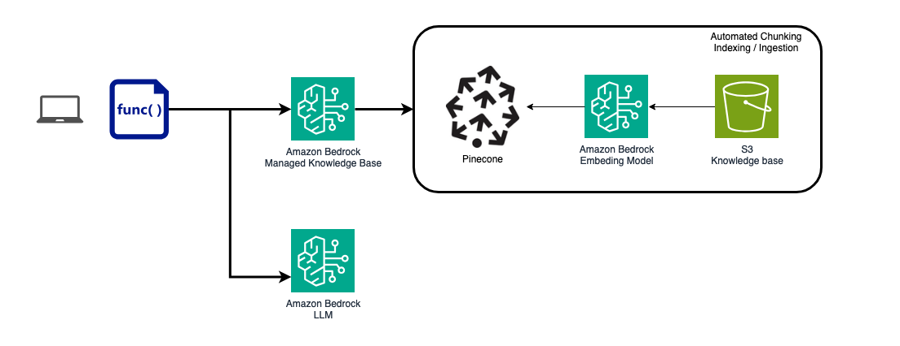
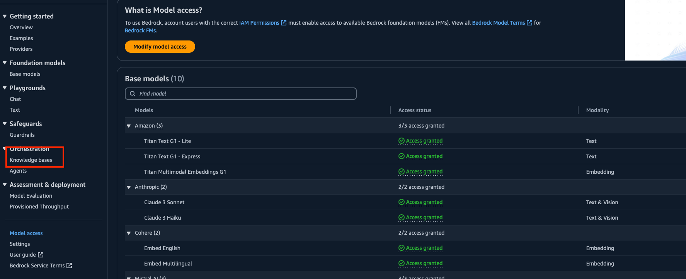
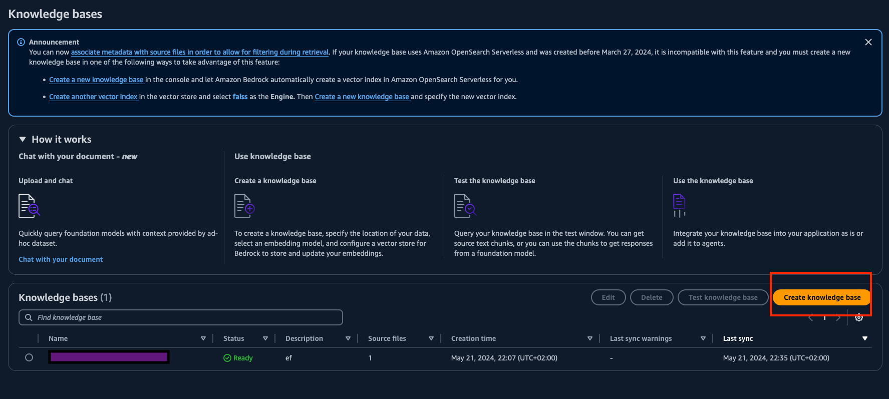
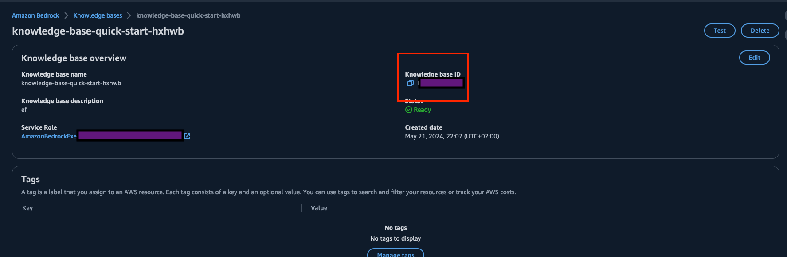
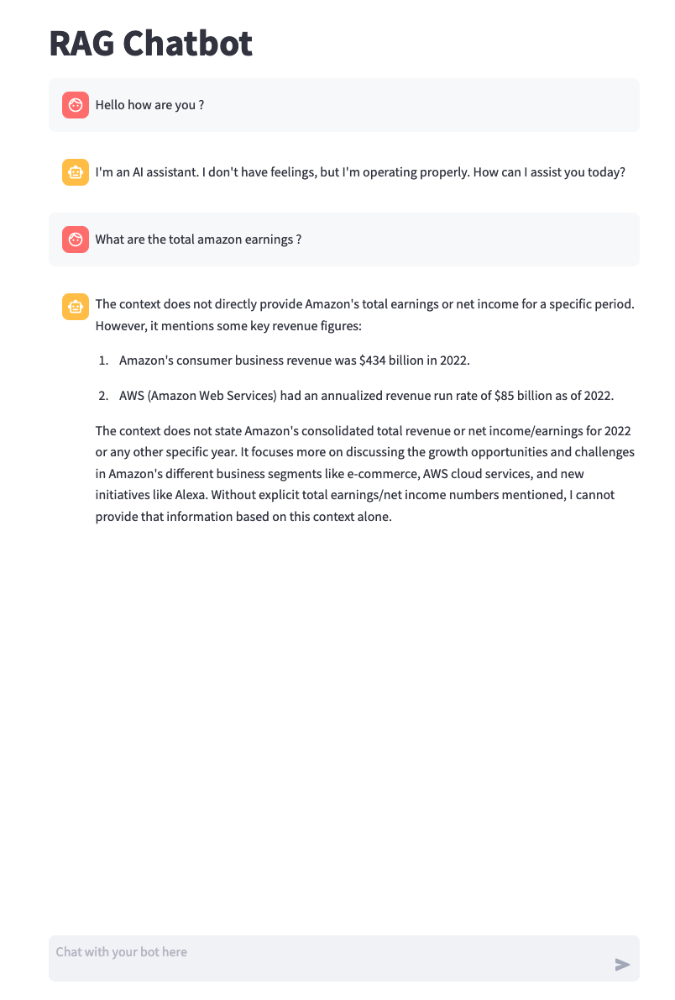

# AWS Bedrock RAG Chatbot Lab

## Overview

In this lab, we will build an advanced chatbot application using Amazon Bedrock and other AWS services. The chatbot will be capable of retrieving information from a knowledge base created from PDF documents stored in an S3 bucket. This hands-on lab is designed to guide you through the entire process, from setting up your development environment to deploying the application in the cloud.

## Architecture Overview



## Lab Structure Overview

1. **Setup Environment**: Configure a Python virtual environment, install dependencies, and set up AWS CLI.
2. **Create Knowledge Base**: Upload PDFs to an S3 bucket and create a Knowledge Base in Amazon Bedrock.
3. **Code Integration**: Insert Knowledge Base ID and AWS profile into the application code.
4. **Run Locally**: Launch the application locally using Streamlit.

## Project Structure

```
.
├── README.md
├── app
│   ├── rag_chatbot_app.py
│   └── rag_chatbot_lib.py
├── docs
│   └── 2022-Shareholder-Letter.pdf
├── images
│   ├── xxxx.png
│   ├── image_1.png
│   ├── image_2.png
│   ├── image_3.png
│   └── image_4.png
└── main.ipynb
```

## Setup Instructions

### 1. Create a Virtual Environment

#### Windows & Mac

1. Open PowerShell or Command Prompt as Administrator
2. Ensure Python is installed and accessible from the command line
3. Navigate to your project directory:
   ```bash
   cd Code\
   ```
4. Create the virtual environment:
   ```bash
   python -m venv .venv
   ```

#### Activating the Virtual Environment

- **Windows**:
  ```bash
  .venv\Scripts\activate
  ```
- **macOS/Linux**:
  ```bash
  source .venv/bin/activate
  ```

### 2. Install Project Dependencies

```bash
pip install -r ./Project/requirements.txt
```

### 3. Configure AWS Profile

1. On the CLI, configure your AWS profile:
   ```bash
   aws configure --profile myprofile
   ```
   Enter:
   - Access Key ID
   - Secret Access Key
   - Default region name: eu-west-3

2. Verify your profile:
   ```bash
   aws configure list-profiles
   ```

3. Export your profile:
   ```bash
   export AWS_PROFILE=myprofile
   ```

### 4. Create Knowledge Base Source

1. Open [main.ipynb](./main.ipynb)
2. Specify your bucket name:
   ```python
   bucket_name = "mybucketname1234"
   ```
3. Follow the notebook cells to create the bucket and upload the document

### 5. Create Knowledge Base in Amazon Bedrock

1. Go to Amazon Bedrock Service and select "Knowledge Base"
   

2. Create a new Knowledge Base using the PDFs uploaded to your S3 bucket
   - Select the S3 bucket (not the individual file)
   - Choose OpenSearch Vector Database
   

3. Wait for the Knowledge Base to be ready and sync

## Code Integration

### 1. Get Knowledge Base ID

- Locate the Knowledge Base ID in the Amazon Bedrock console
- Insert it into your code where required
  

### 2. Add AWS Profile to API Calls

- Ensure all API calls reference your configured AWS profile name
- Replace `'<default_profile>'` in the code with your profile name
  

## Running the Application

1. Navigate to the project root folder
2. Run the Streamlit application:
   ```bash
   streamlit run app/rag_chatbot_app.py
   ```

3. Open the provided local URL in your browser to interact with the chatbot
   

## Conclusion

Congratulations! You have successfully set up and launched a RAG chatbot using Amazon Bedrock and Streamlit.