# AWS Bedrock RAG Chatbot Lab

## Overview

In this lab, we will build an advanced chatbot application using Amazon Bedrock and other AWS services. The chatbot will be capable of retrieving information from a knowledge base created from PDF documents stored in an S3 bucket. This hands-on lab is designed to guide you through the entire process, from setting up your development environment to deploying the application in the cloud.

## Architecture Overview


## Lab Structure Overview

1. **Setup Environment**: Configure a Python virtual environment, install dependencies, and set up AWS CLI.
2. **Create Knowledge Base**: Upload PDFs to an S3 bucket and create a Knowledge Base in Amazon Bedrock.
3. **Code Integration**: Insert Knowledge Base ID and AWS profile into the application code.
4. **Run Locally**: Launch the application locally using Streamlit.

## Project Structure

```
.
├── README.md
├── app
│   ├── rag_chatbot_app.py
│   └── rag_chatbot_lib.py
├── docs
│   └── 2022-Shareholder-Letter.pdf
├── images
│   ├── arnSecret.png
│   .
│   .
│   ├
│   └── sync.png
└── main.ipynb
```

## Setup Instructions

### 1. Create a Virtual Environment

#### Windows & Mac

1. Open PowerShell or Command Prompt as Administrator
2. Ensure Python is installed and accessible from the command line
3. Navigate to your project directory:
   ```bash
   cd Code\
   ```
4. Create the virtual environment:
   ```bash
   python -m venv .venv
   ```

#### Activating the Virtual Environment

- **Windows**:
  ```bash
  .venv\Scripts\activate
  ```
- **macOS/Linux**:
  ```bash
  source .venv/bin/activate
  ```

### 2. Install Project Dependencies

```bash
pip install -r ./Project/requirements.txt
```

### 3. Configure AWS Profile

1. On the CLI, configure your AWS profile:
   ```bash
   aws configure --profile myprofile
   ```
   Enter:
   - Access Key ID
   - Secret Access Key
   - Default region name: us-east-1

2. Verify your profile:
   ```bash
   aws configure list-profiles
   ```

3. Export your profile:
   ```bash
   export AWS_PROFILE=myprofile
   ```

### 4. Create Knowledge Base Source

1. Open [main.ipynb](./main.ipynb)
2. Specify your bucket name:
   ```python
   bucket_name = "mybucketname1234"
   ```

3. Add AWS Profile to API Calls

- Ensure all API calls reference your configured AWS profile name
- Replace `'<default_profile>'` in the code with your profile name

4. Follow the notebook cells to create the bucket and upload the document


### 5. Pinecone Setup
1. Create an account on https://login.pinecone.io
2. Do the basic setup (Q&A Chatbot, AWS ect)
3. Save somewhere the **apiKey** !
3. Create an index
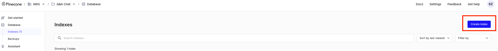
4. Setup the index: give a name, enter the dimension of the vectors to **1024** and leave all the other values by default.
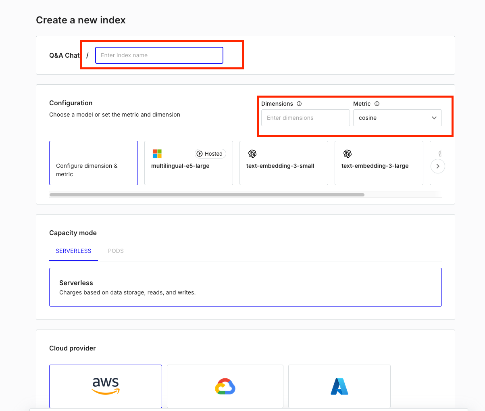
5. Save somewhere the index host address
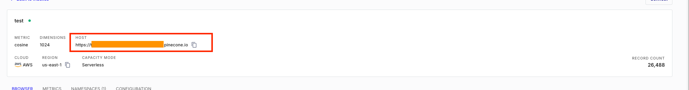


### 6. Secret Manager Setup
1. Log into the AWS Console. You must be on  **us-east-1** region !
2. Go to Secret Manager Service
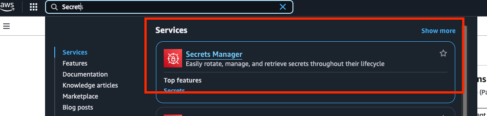
2. Create a secret
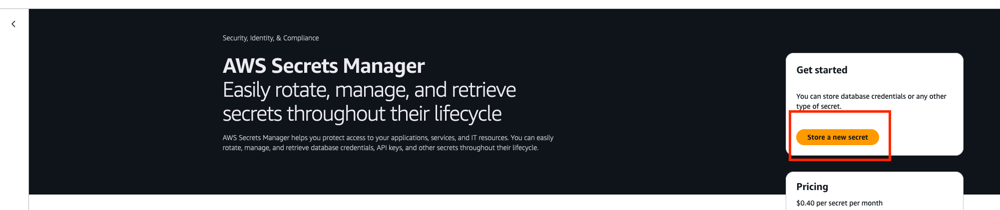
3. Enter the key value pair (apiKey and the value you saved)
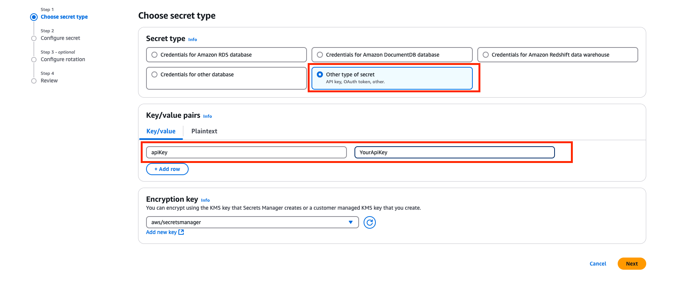
4. Give a name to your Secret (Please use a personal prefix like your name)
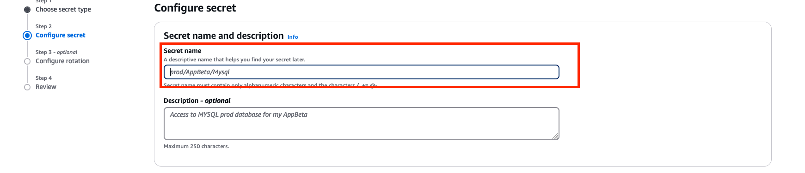
5. Finish the process leaving all the values by default
6. Once your secret created, click on it and retreive the arn as follow
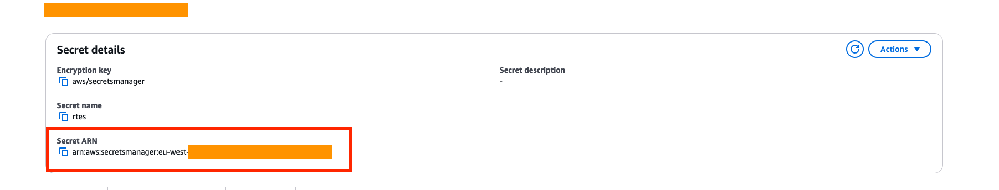


### 7. Create Knowledge Base in Amazon Bedrock

1. Go to Amazon Bedrock Service, select "Knowledge Base" and create a vector store
   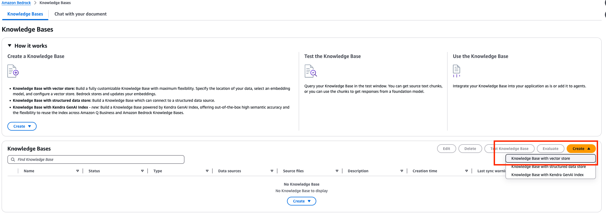
2. Select S3 as a Data Source, Give a name to this Knowledge Base. (Please use a personal prefix like your name)
3. Browse S3 and select the s3 bucket you created earlier.
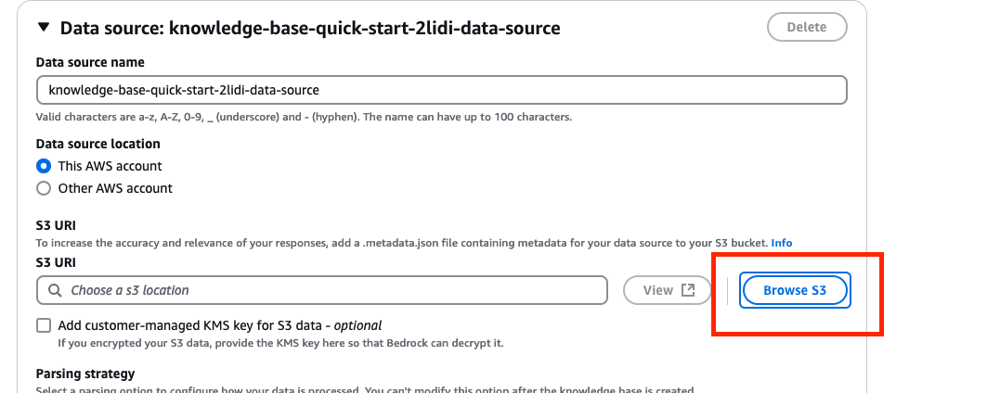
4. Make sure the finale path as a **/** at the end.
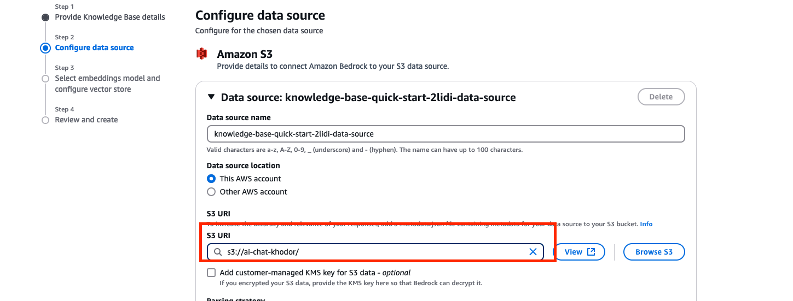
5. Select Titan Text Embeddings v2 fot he Embeddings Model and Pinecone as the VectorDB.
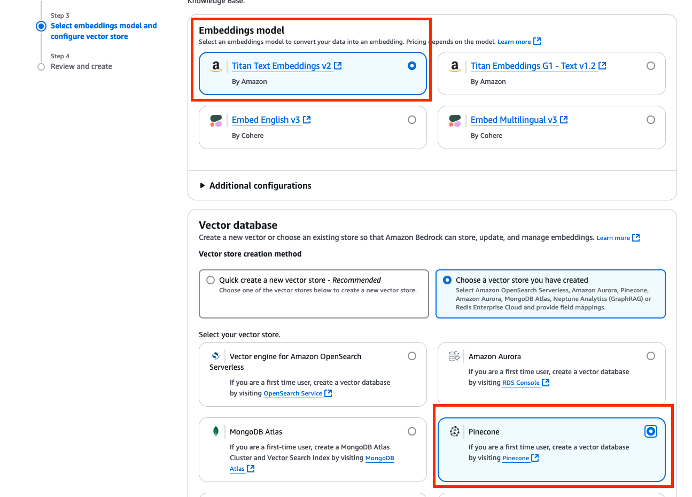
6. Enter the Pinecone Infiormation Required, leave the rest by default.
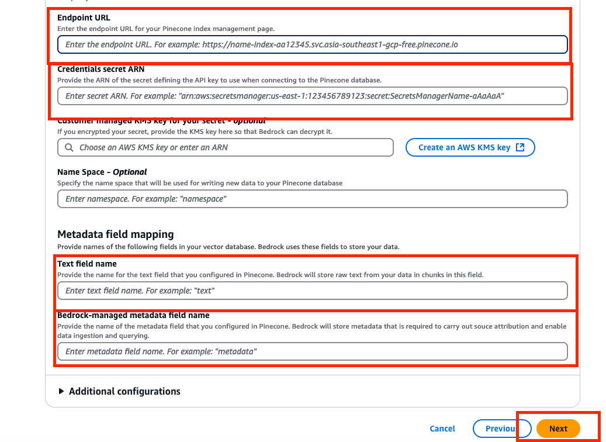
7. Once the Knowledge Base Created by Bedrock you can Sync the data.
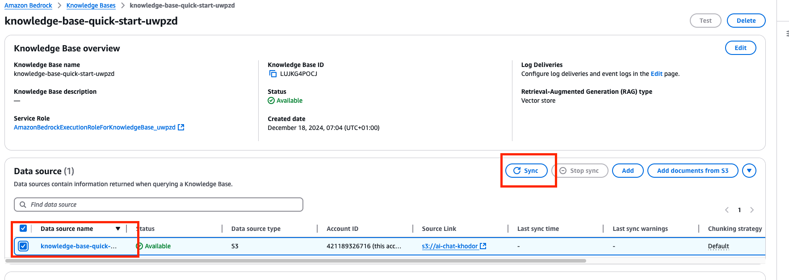
7. Retrieve the knowledge base ID of your Knowledge Base.
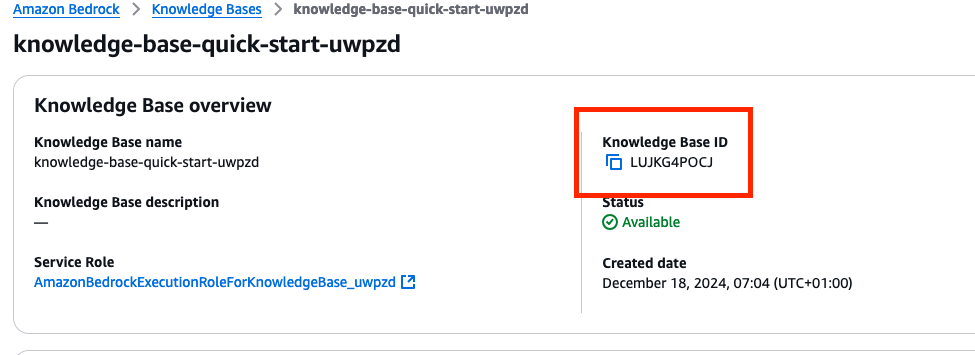
8. Once done you can test you RAG using the user interface and select the conversational LLM you want.
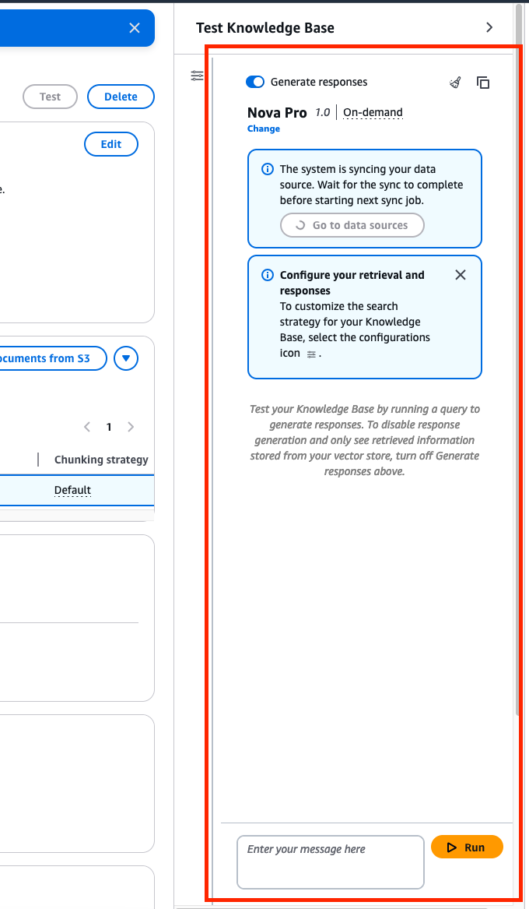


## 8. Code Integration

1. Add AWS Profile to API Calls

- Ensure all API calls reference your configured AWS profile name
- Replace `'<default_profile>'` in the code with your profile name

2. Put you knowledge base ID into the code
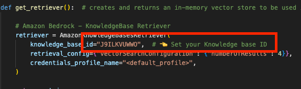
## Running the Application

1. Navigate to the project root folder
2. Run the Streamlit application:
   ```bash
   streamlit run app/rag_chatbot_app.py
   ```

3. Open the provided local URL in your browser to interact with the chatbot
     

## Conclusion

Congratulations! You have successfully set up and launched a RAG chatbot using Amazon Bedrock and Streamlit.