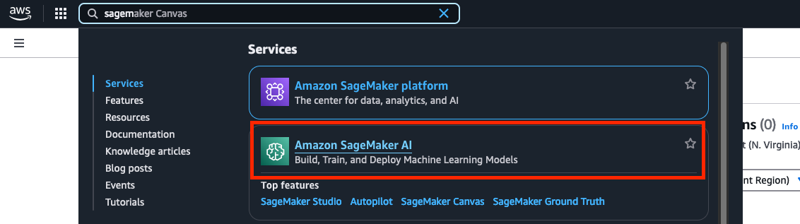
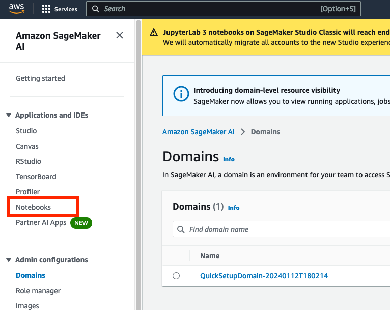
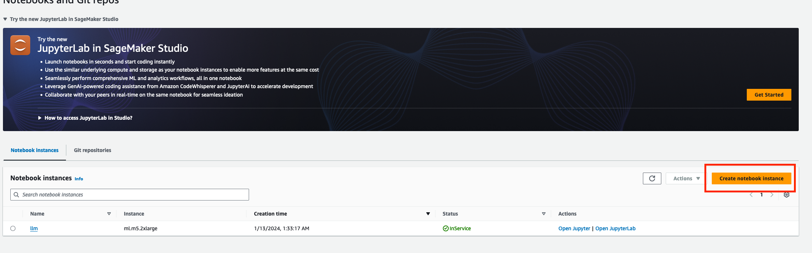
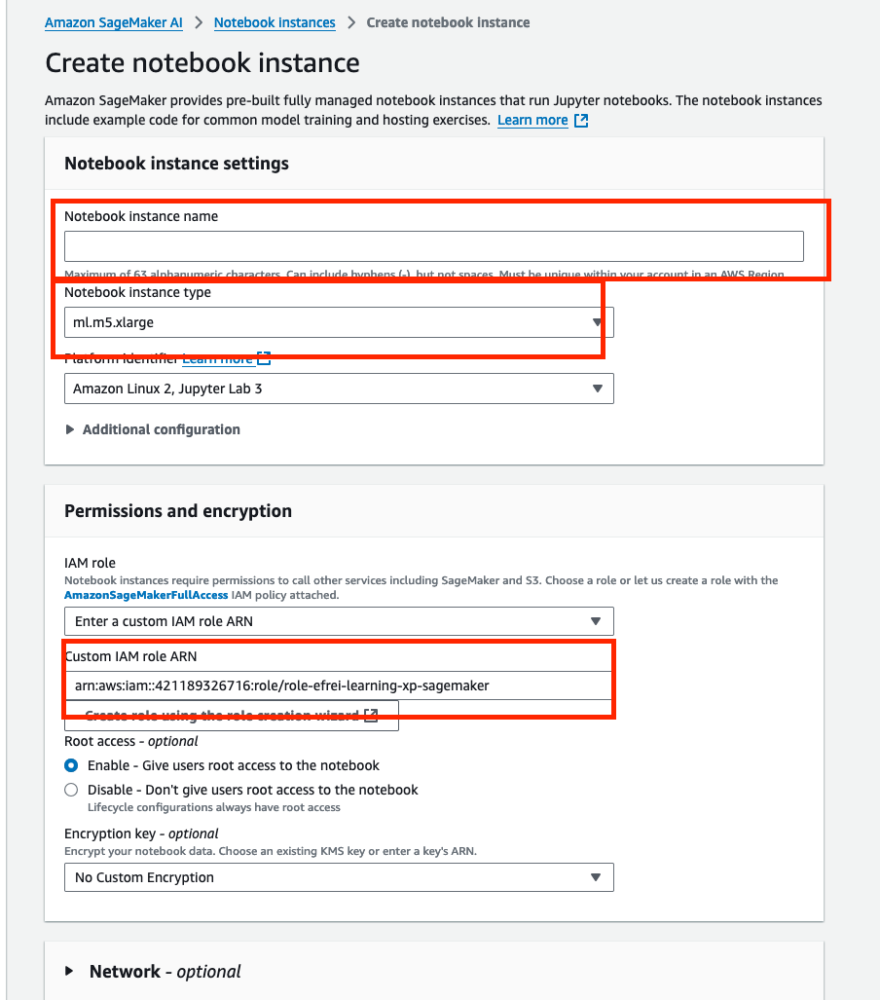
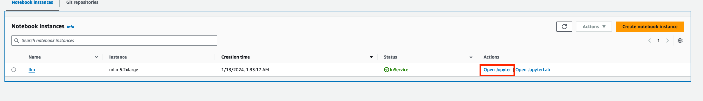
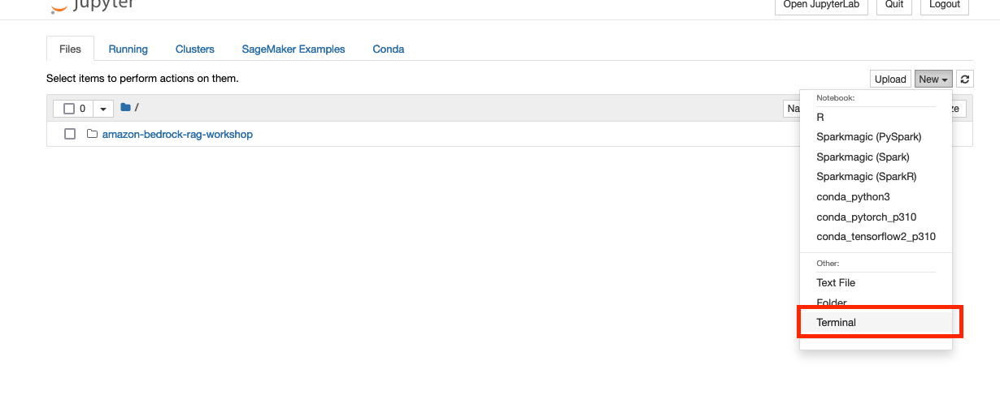

#  Reinforcement Learning from Human Feedback & Model Evaluation Course

## Course Goals
The primary objectives of this course are to:
- Understand the fundamentals of Reinforcement Learning from Human Feedback (RLHF)
- Understand the common Model Evaluation Techniques
- Hands-on with RAG and Chunking

## Course Agenda

1. Reinforcement Learning from Human Feedback & Model Evaluaiton Presentation
2. Local Code using Ragas: [Local Ragas Notebook](./rag_evaluation.ipynb)
3. [Amazon Bedrock RAG Workshop](https://github.com/aws-samples/amazon-bedrock-rag-workshop)
   - For the setup follow the [instruction bellow](#Amazon-bedrock-RAG-Workshop-Setup)
4. Finish [Project](../Project)
5. Bonus: [Flan T5 Fine Tuning](https://colab.research.google.com/drive/1jCkpikz0J2o20FBQmYmAGdiKmJGOMo-o?usp=sharing)

### Amazon Bedrock RAG Workshop Setup
1. Go to SageMaker AI Service


2. Click on Notebook


3. Create a Notebook


3. Enter the following configuration
- Notebook Name: choose a name
- Select the ml.m5.xlarge instance
- Select the role: arn:aws:iam::421189326716:role/role-efrei-learning-xp-sagemaker
- Leave the rest buy default


4. Once create you can open the Jupyter


5. Open a terminal


6. Go to the SageMaker folder & and clone the following repo
   ```bash
   git clone https://github.com/aws-samples/amazon-bedrock-rag-workshop.git
   ```


7. Go back to the folders and start the workshop !
note: the last lab might not work, let me know


## Setting Up Your Development Environment

### Creating a Virtual Environment

#### Windows Users
1. Open PowerShell or Command Prompt as Administrator
2. Ensure Python is installed and accessible from the command line
3. Navigate to your project directory:
   ```powershell
   cd Code\
   ```
4. Create the virtual environment:
   ```powershell
   python -m venv .venv
   ```

#### Activating the Virtual Environment

##### Windows
```powershell
.venv\Scripts\activate
```

##### macOS/Linux
```bash
source .venv/bin/activate
```

### Managing Dependencies
1. Install project dependencies:
   ```powershell
   pip install -r ./day_X_X/requirements.txt
   ```

2. To deactivate the virtual environment:
   ```powershell
   deactivate
   ```

### Configure AWS Profile 
1. On the CLI, configure your AWS profile:
   ```bash
   aws configure --profile myprofile
   ```
   Enter:
   - Access Key ID
   - Secret Access Key
   - Default region name: eu-west-3

2. Verify your profile:
   ```bash
   aws configure list-profiles
   ```

3. Export your profile:
   ```bash
   export AWS_PROFILE=myprofile
   ```
